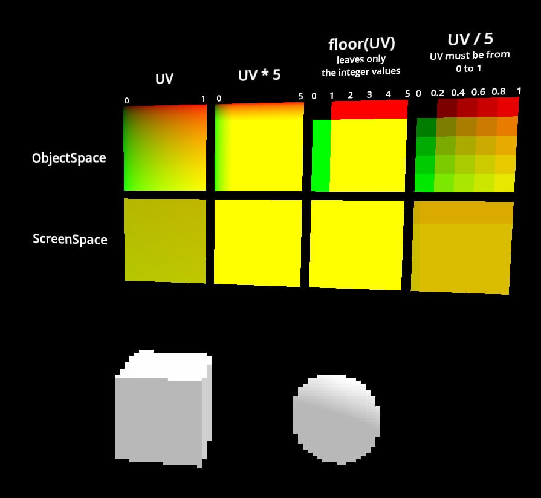
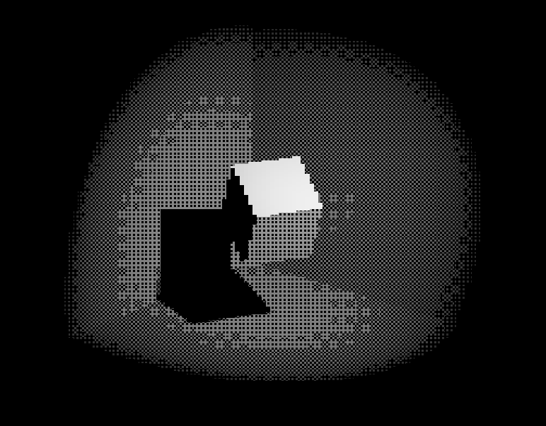

# ScreenSpacePostProcessing

## TL;DR

Simple screen space shaders made to learn more about shading techniques.

## Pixelation effect



```
// pixelation effect
// create a quad and apply this shader to it
// in the quad, flip faces and scale it to (2,2)
shader_type spatial;
render_mode unshaded;

uniform sampler2D _screen : source_color, hint_screen_texture, filter_nearest;
uniform float _scale = 256.0;

vec3 pixelate(sampler2D tex, vec2 uv) {
  uv = floor(uv * _scale) / _scale;
  return texture(tex, uv).rgb;
}

void vertex() {
  // this code makes the quad full screen always in front of the camera
  POSITION = vec4(VERTEX, 1.0);
}

void fragment() {
  ALBEDO = pixelate(_screen, SCREEN_UV);
}

```

>This can also be used to downscale a texture.

### CREDITS
- https://www.patrykgalach.com/2020/06/01/pixelated-effect-in-unity-shader-graph/#:~:text=To%20create%20a%20pixelated%20effect,back%20by%20the%20same%20value
- https://www.ronja-tutorials.com/post/039-screenspace-texture/

## Dithering effect



>It uses a bayer pattern (with a nearest filtering) to compare each pixel from the screen texture to assign a value.

```py
// sample textures
vec2 ratio = normalize(VIEWPORT_SIZE);
vec3 p = texture(_pattern, SCREEN_UV *_dither_scale * ratio).rgb;
vec3 n = texture(_noise, SCREEN_UV *_dither_scale).rgb;
vec3 s = pixelate(_screen, SCREEN_UV);

// compute luminosity using yuv color space
float lum = (s.r * 0.299) + (s.g * 0.587) + (s.b * 0.114); // luminosity of screen texture pixel
float sh = (p.r * 0.299) + (p.g * 0.587) + (p.b * 0.114); // luminosity of bayer pattern pixel
float nh = (n.r * 0.299) + (n.g * 0.587) + (n.b * 0.114); // luminosity of noise pixel

// reduce bit depth
lum = floor(lum * float(bits)) / float(bits);

// compare pixels
vec3 o;
if (lum > sh * _thresh) {
	o = s;
}
else {
	o = _shadow_col * _shadow_strength;
}
ALBEDO = o;
```

### CREDITS

- https://forums.tigsource.com/index.php?topic=40832.msg1363742#msg1363742
- https://github.com/tromero/BayerMatrix?tab=readme-ov-file
- https://godotshaders.com/shader/dither-gradient-shader/
- https://danielilett.com/2020-02-26-tut3-9-obra-dithering/
- https://people.ece.ubc.ca/irenek/techpaps/introip/manual04.html